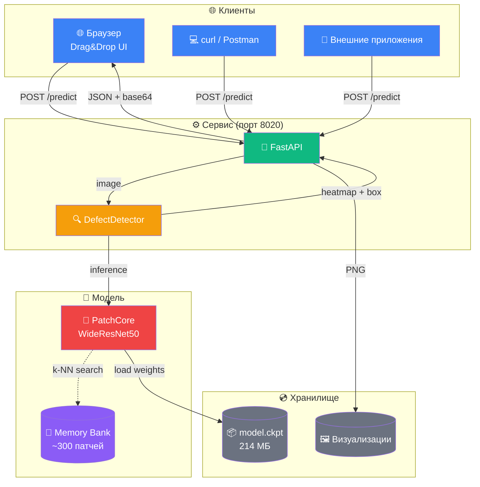
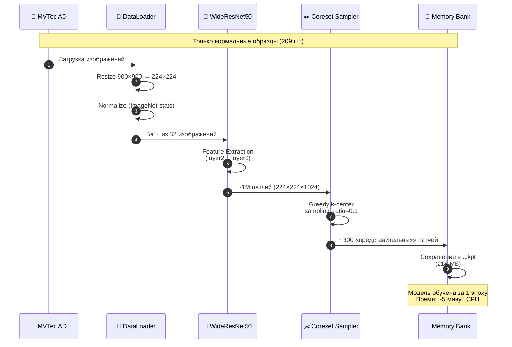
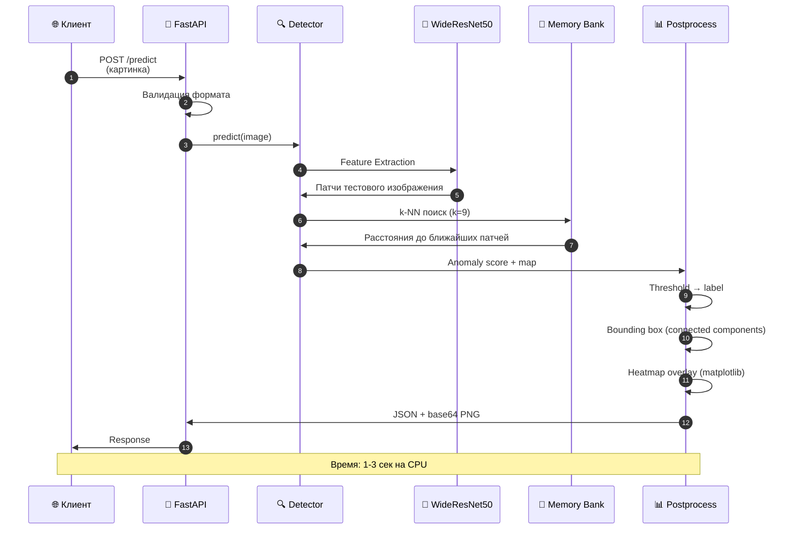
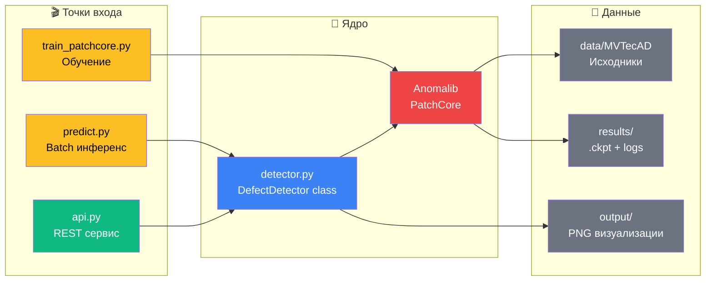
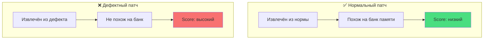

<div align="center">

# 🔍 Defect Detection

**Промышленная система машинного зрения для обнаружения дефектов на производстве**

[](https://www.python.org/)
[](https://pytorch.org/)
[](https://fastapi.tiangolo.com/)
[](https://github.com/openvinotoolkit/anomalib)
[](LICENSE)

*Anomaly detection без примеров дефектов — обучение только на нормальных образцах*

</div>

---

## 📊 Результаты

<div align="center">

| Метрика | Значение | Описание |
|:-------:|:--------:|:---------|
| 🎯 **Image AUROC** | **1.0000** | Точность классификации (дефект/норма) |
| 📊 **Image F1 Score** | **0.9920** | Баланс precision/recall |
| 🗺️ **Pixel AUROC** | **0.9815** | Точность локализации дефекта |
| 🔬 **Pixel F1 Score** | **0.7301** | Точность сегментации |

**Достигнут уровень Research SOTA** (PatchCore, CVPR 2022) на датасете MVTec AD.

</div>

---

## 🎯 Что делает система

<table>
<tr>
<td width="50%">

### Вход
- 📷 Изображение детали (PNG/JPG)
- 🔄 Размер: любой (нормализуется до 224×224)
- 📡 Источник: файл, камера, REST API

</td>
<td width="50%">

### Выход
- ✅ **Вердикт**: `NORMAL` или `DEFECT`
- 📊 **Score**: уверенность (0.0 – 1.0)
- 🗺️ **Heatmap**: карта аномалий
- 🟩 **Bounding box**: рамка дефекта

</td>
</tr>
</table>

---

## 🏗️ Архитектура

### High-Level обзор



---

### Детально: ML Pipeline

#### 🔄 Фаза 1. Обучение (Offline)



#### 🎯 Фаза 2. Инференс (Online)



---

### Модули



---

## 🔬 Как работает PatchCore

**PatchCore** — метод anomaly detection, который **не требует примеров дефектов** при обучении. Ключевая идея — «банк памяти» из нормальных патчей.

### 📚 Три фазы

<table>
<tr>
<td width="33%" valign="top">

### 1️⃣ Feature Extraction

Каждое изображение пропускается через **предобученный WideResNet50**. Из промежуточных слоёв (`layer2`, `layer3`) извлекаются **карты признаков** — абстрактные «отпечатки» локальных областей.

**Что получаем:** для каждой позиции на картинке — вектор из 1024 чисел.

</td>
<td width="33%" valign="top">

### 2️⃣ Coreset Sampling

Из ~1 000 000 патчей отбираем **10% самых представительных** через **Greedy k-center** — алгоритм, который максимизирует разнообразие.

**Результат:** ~300 патчей в «банке памяти». Меньше памяти, быстрее поиск.

</td>
<td width="33%" valign="top">

### 3️⃣ Anomaly Scoring

Для новой картинки: извлекаем патчи → ищем **k=9 ближайших** в банке (k-NN) → усредняем расстояния.

**Логика:** если патч «далеко» от всех нормальных — это аномалия. Score = усреднённое расстояние.

</td>
</tr>
</table>

### 🎨 Почему это работает



**Ключевое преимущество:** модель **никогда не видела дефектов**. Она выучила «как выглядит норма» и находит всё, что не подходит под это описание. Это решает главную боль реального производства — **дефекты редки, собирать датасет невозможно**.

---

## 🛠️ Технологический стек

<table>
<tr>
<td valign="top" width="50%">

### 🧠 Machine Learning
- **Python 3.11**
- **PyTorch 2.x** (CPU)
- **Anomalib 1.1.0** — фреймворк anomaly detection
- **PatchCore** — алгоритм (CVPR 2022)
- **WideResNet50** — backbone (timm)
- **scikit-learn** — метрики и утилиты

### 🌐 Backend
- **FastAPI** — REST API
- **Uvicorn** — ASGI-сервер
- **Pydantic** — валидация данных
- **python-multipart** — загрузка файлов

</td>
<td valign="top" width="50%">

### 📊 Данные и визуализация
- **MVTec AD** — датасет (bottle)
- **NumPy** — массивы
- **Pillow** — изображения
- **OpenCV** — CV-операции
- **Matplotlib** — графики и heatmap
- **Pandas** — таблицы

### 🚀 DevOps
- **venv** — изоляция окружения
- **requirements.txt** — фиксация версий
- **Git** — контроль версий
- **Jupyter Lab** — EDA

</td>
</tr>
</table>

---

## 📁 Структура проекта

```
defect-detection/
│
├── 🌐 api.py                    # FastAPI сервис (порт 8020)
├── 🧩 detector.py               # Класс DefectDetector
├── 🎯 predict.py                # Batch-инференс с визуализацией
├── 🎓 train_patchcore.py        # Скрипт обучения
├── 📋 requirements.txt          # Зависимости
├── 📝 README.md
├── 🚫 .gitignore
│
├── 📓 notebooks/
│   └── 01_eda.ipynb             # Разведочный анализ данных
│
├── 📊 docs/
│   ├── eda_summary.csv          # Статистика по дефектам
│   └── eda_counts.csv           # Количество изображений
│
├── 📁 data/                     # ← в .gitignore
│   └── MVTecAD/bottle/
│       ├── train/good/          # 209 нормальных (обучение)
│       ├── test/                # 83 тестовых
│       │   ├── good/            # 20 норм
│       │   ├── broken_large/    # 20 больших сколов
│       │   ├── broken_small/    # 22 малых скола
│       │   └── contamination/   # 21 загрязнение
│       └── ground_truth/        # Маски дефектов
│
├── 🎯 results/                  # ← в .gitignore
│   └── Patchcore/MVTec/bottle/
│       └── v3/weights/lightning/
│           └── model.ckpt       # 214 МБ, обученная модель
│
└── 🖼️ output/                   # ← в .gitignore
    ├── norm_result.png
    ├── defect_large_result.png
    ├── defect_small_result.png
    └── contamination_result.png
```

---

## 🚀 Быстрый старт

### 📦 Предварительные требования

- **Python 3.11** (не 3.12+ — несовместимость с Anomalib)
- **~10 ГБ свободного места**
- **Kaggle API** для скачивания датасета

### 1️⃣ Клонирование и окружение

```bash
git clone <repo-url>
cd defect-detection

# Виртуальное окружение
python -m venv venv311
venv311\Scripts\activate              # Windows
source venv311/bin/activate           # Linux/Mac

# Зависимости
pip install -r requirements.txt
```

### 2️⃣ Данные

**Вариант A — через Kaggle CLI:**

```bash
# Получить kaggle.json: https://www.kaggle.com/settings → API → Create New Token
# Положить в C:\Users\<User>\.kaggle\access_token

kaggle datasets download -d ipythonx/mvtec-ad -p ./data/MVTecAD --unzip

# Оставить только bottle, удалить остальное
cd data/MVTecAD
rmdir /s /q cable capsule carpet grid hazelnut leather metal_nut pill screw tile toothbrush transistor wood zipper
cd ../..
```

**Вариант B — вручную:**

Скачать с [официального сайта MVTec](https://www.mvtec.com/company/research/datasets/mvtec-ad) и распаковать `bottle/` в `data/MVTecAD/`.

### 3️⃣ Обучение

```bash
python train_patchcore.py
```

**Что произойдёт:**
- Модель извлечёт патчи из 209 нормальных бутылок
- Создаст «банк памяти» с 10% лучших патчей
- Протестирует на 83 тестовых изображениях
- Сохранит результат в `results/Patchcore/MVTec/bottle/vN/`

**Время:** ~5–7 минут на CPU.

### 4️⃣ Запуск сервиса

```bash
python api.py
```

**Сервис доступен:**

| URL | Описание |
|-----|----------|
| 🌐 http://localhost:8020 | Drag&Drop UI |
| 📚 http://localhost:8020/docs | Swagger UI |
| ❤️ http://localhost:8020/health | Healthcheck |

### 5️⃣ Тестирование

**Через браузер:**

1. Открыть http://localhost:8020
2. Перетащить картинку
3. Получить результат

**Через curl:**

```bash
curl -X POST http://localhost:8020/predict \
     -F "file=@data/MVTecAD/bottle/test/broken_large/000.png"
```

---

## 📡 API Reference

### `GET /health`

Проверка статуса сервиса.

**Response:**
```json
{
  "status": "ok",
  "model_path": "results/Patchcore/MVTec/bottle/v3/weights/lightning/model.ckpt",
  "model_exists": true
}
```

---

### `POST /predict`

Детекция дефектов на изображении.

**Request:**
```http
POST /predict
Content-Type: multipart/form-data

file: <binary image>
```

**Response:**
```json
{
  "anomaly_score": 0.8253,
  "label": "DEFECT",
  "box": [74.0, 59.0, 211.0, 223.0],
  "box_score": 0.8459,
  "overlay_base64": "iVBORw0KGgoAAAANSUhEUg...",
  "filename": "bottle.png"
}
```

**Поля:**

| Поле | Тип | Описание |
|------|-----|----------|
| `anomaly_score` | float | Степень аномальности (0.0–1.0) |
| `label` | string | `NORMAL` или `DEFECT` |
| `box` | array\|null | Bounding box `[x1, y1, x2, y2]` |
| `box_score` | float\|null | Уверенность рамки |
| `overlay_base64` | string | PNG с overlay (base64) |

---

## 🖼️ Примеры результатов

<div align="center">

| Категория | Score | Heatmap | Описание |
|:---------:|:-----:|:-------:|----------|
| ✅ **NORMAL** | 0.28 | Слабое кольцо по краю | Нормальная бутылка |
| ❌ **DEFECT** (small) | 0.60 | Маленькое пятно | Малый скол |
| ❌ **DEFECT** (contamination) | 0.71 | Пятно в центре | Загрязнение |
| ❌ **DEFECT** (large) | 0.83 | Большое пятно | Большой скол |

**Логика score:** чем серьёзнее дефект — тем выше `anomaly_score`.

</div>

---

## 📊 Данные

**MVTec AD** — стандартный бенчмарк для anomaly detection от MVTec Software.

<table>
<tr>
<td valign="top" width="50%">

### Статистика (категория `bottle`)

| Split | Класс | Кол-во |
|-------|-------|-------:|
| Train | good | 209 |
| Test | good | 20 |
| Test | broken_large | 20 |
| Test | broken_small | 22 |
| Test | contamination | 21 |
| **Всего** | | **292** |

**Размер изображений:** 900×900 px

</td>
<td valign="top" width="50%">

### Размеры дефектов

| Тип | Mean | Min | Max |
|-----|-----:|----:|----:|
| broken_large | 11.7% | 4.1% | 27.4% |
| broken_small | 3.1% | 0.9% | 8.1% |
| contamination | 8.5% | 0.6% | 16.5% |

**Вывод:** дефекты занимают 1–27% площади — модель должна быть чувствительной к мелким деталям.

</td>
</tr>
</table>

---

## 🎓 Как воспроизвести

### Проверка метрик

После обучения метрики выводятся в консоль:

```
============================================================
РЕЗУЛЬТАТЫ
============================================================
  image_AUROC: 1.0000
  image_F1Score: 0.9920
  pixel_AUROC: 0.9815
  pixel_F1Score: 0.7301
```

### Проверка на своих картинках

1. Положить картинку в `data/`
2. Открыть `predict.py`
3. Изменить `test_images` на свой путь
4. Запустить `python predict.py`
5. Смотреть результат в `output/`

---

## 🔮 Roadmap

- [x] ✅ Базовый RAG — PatchCore на MVTec AD
- [x] ✅ FastAPI сервис
- [x] ✅ HTML UI
- [ ] 🔄 Docker-контейнеризация
- [ ] ⚡ ONNX-экспорт (ускорение 2–3×)
- [ ] 🎓 Active Learning (дообучение на «неуверенных»)
- [ ] 🎥 Real-time видео (RTSP)
- [ ] 📱 Telegram-бот для оператора
- [ ] 🧊 3D-детекция (Real3D-AD)
- [ ] 🎨 Multi-category MVTec (15 категорий)

---

## 🧪 Технические детали

### Гиперпараметры PatchCore

| Параметр | Значение | Почему |
|----------|---------:|--------|
| `backbone` | `wide_resnet50_2` | Стандарт из статьи |
| `layers` | `["layer2", "layer3"]` | Средний + глубокий уровни |
| `coreset_sampling_ratio` | 0.1 | Компромисс точность/скорость |
| `num_neighbors` | 9 | k-NN для scoring |
| `image_size` | (224, 224) | Native размер backbone |

### Формат `.ckpt`

Файл 214 МБ содержит:

- **Веса WideResNet50** (~100 МБ, 25M параметров)
- **Memory Bank** (~10 МБ, ~300 патчей × 1024 float)
- **Состояние модели** (настройки, метрики)

Загрузка через `torch.load(path, weights_only=False)` — для собственных доверенных чекпоинтов.

---

## 📝 Лицензия

MIT License — свободно используйте, модифицируйте и распространяйте.

---

## 👤 Автор

**Максим Нагайцев**

- 💼 LinkedIn: [maksim-nagaytsev-ab2311432](https://www.linkedin.com/in/maksim-nagaytsev-ab2311432)
- 🐙 GitHub: [@Vaks911](https://github.com/Vaks911)

---

<div align="center">

⭐ **Если проект был полезен — поставьте звезду!**

*Сделано с ❤️ и большим количеством ночного кофе*

</div>